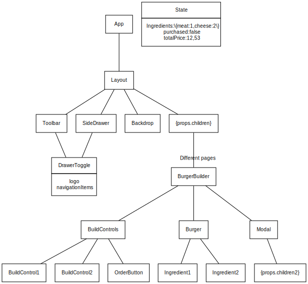

# Burger Builder

## Create new project
`npm i -g create-react-app`

After that you can use it:

```bash
gius@dev:~$ create-react-app burger-builder

Creating a new React app in /home/gius/burger-builder.

Installing packages. This might take a couple of minutes.
Installing react, react-dom, and react-scripts...


> uglifyjs-webpack-plugin@0.4.6 postinstall /home/gius/burger-builder/node_modules/uglifyjs-webpack-plugin
> node lib/post_install.js

+ react-scripts@1.1.5
+ react@16.5.2
+ react-dom@16.5.2
added 1300 packages from 729 contributors and audited 14536 packages in 74.482s
found 0 vulnerabilities


Success! Created burger-builder at /home/gius/burger-builder
Inside that directory, you can run several commands:

  npm start
    Starts the development server.

  npm run build
    Bundles the app into static files for production.

  npm test
    Starts the test runner.

  npm run eject
    Removes this tool and copies build dependencies, configuration files
    and scripts into the app directory. If you do this, you can’t go back!

We suggest that you begin by typing:

  cd burger-builder
  npm start

Happy hacking!

```

### Eject

  npm run eject

### Clean up

https://fonts.google.com/specimen/Open+Sans?selection.family=Open+Sans:400,700

`<link href="https://fonts.googleapis.com/css?family=Open+Sans:400,700" rel="stylesheet">`

# Design


